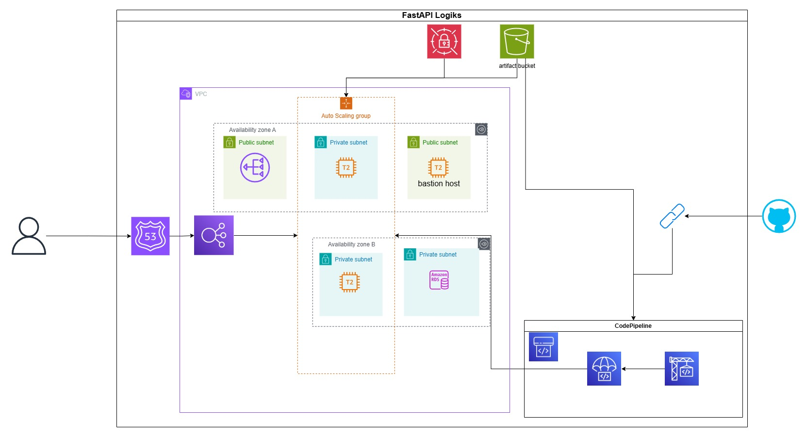

# 📷 FastAPI Book API

This project is a simple **FastAPI** application, developed for Logiks Solutions and deployed on AWS.
You can access the API here https://books-fastapi.site.

---

## Architecture Visualization

## 🛠 Architecture Overview

- **FastAPI** app running on EC2 instances behind an **Auto Scaling Group** and **Elastic Load Balancer** (ALB).
- **Amazon RDS** for relational database storage (metadata persistence).
- **Amazon S3** for storing artifacts.
- **AWS CodePipeline** for CI/CD, pulling source code from **GitHub** and deploying updates automatically.

---

## ⚙️ Components

| Component        | Service                                 |
|:-----------------|:----------------------------------------|
| **API**          | FastAPI                                 |
| **Compute**      | EC2 (T2 instances) with Auto Scaling Group |
| **Load Balancing**| Application Load Balancer              |
| **Database**     | Amazon RDS (inside a private subnet)    |
| **CI/CD**        | AWS CodePipeline (source: GitHub)       |
| **Networking**   | VPC with public and private subnets across 2 AZs |
| **ENV Variables**| Secrets Manager                         |

---

## 📦 Deployment Process

1. **Push code** to GitHub repository.
2. **AWS CodePipeline** detects changes and triggers a build and deployment.
3. **Updated FastAPI application** is deployed to the EC2 instances automatically.

---

## 📚 CRUD Endpoints

The following basic book management endpoints are available:

- `GET /books`: Retrieve all books.
- `POST /books`: Create a new book.
- `GET /books/{id}`: Retrieve a book by ID.
- `PUT /books/{id}`: Update a book by ID.
- `DELETE /books/{id}`: Delete a book by ID.

---

## 🧪 Testing

- Integration tests are implemented using **Pytest**.
- Tests validate API behavior and ensure endpoints function correctly after deployment.

---
